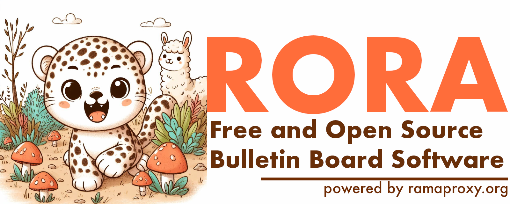

[![Crates.io][crates-badge]][crates-url]
[![Docs.rs][docs-badge]][docs-url]
[![MIT License][license-mit-badge]][license-mit-url]
[![Apache 2.0 License][license-apache-badge]][license-apache-url]
[![Build Status][actions-badge]][actions-url]

[![Discord][discord-badge]][discord-url]
[![Buy Me A Coffee][bmac-badge]][bmac-url]
[![GitHub Sponsors][ghs-badge]][ghs-url]

[crates-badge]: https://img.shields.io/crates/v/rora.svg
[crates-url]: https://crates.io/crates/rora
[docs-badge]: https://img.shields.io/docsrs/rora/latest
[docs-url]: https://docs.rs/rora/latest/rora/index.html
[license-mit-badge]: https://img.shields.io/badge/license-MIT-blue.svg
[license-mit-url]: https://github.com/plabayo/rora/blob/main/LICENSE-MIT
[license-apache-badge]: https://img.shields.io/badge/license-APACHE-blue.svg
[license-apache-url]: https://github.com/plabayo/rora/blob/main/LICENSE-APACHE
[actions-badge]: https://github.com/plabayo/rora/workflows/CI/badge.svg
[actions-url]: https://github.com/plabayo/rora/actions?query=workflow%3ACI+branch%main

[discord-badge]: https://img.shields.io/badge/Discord-%235865F2.svg?style=for-the-badge&logo=discord&logoColor=white
[discord-url]: https://discord.gg/29EetaSYCD
[bmac-badge]: https://img.shields.io/badge/Buy%20Me%20a%20Coffee-ffdd00?style=for-the-badge&logo=buy-me-a-coffee&logoColor=black
[bmac-url]: https://www.buymeacoffee.com/plabayo
[ghs-badge]: https://img.shields.io/badge/sponsor-30363D?style=for-the-badge&logo=GitHub-Sponsors&logoColor=#EA4AAA
[ghs-url]: https://github.com/sponsors/plabayo

Free and Open Source Bulletin Board Software.

Powered by _rama_ (<https://ramaproxy.org>), developed using the Rust language.

> This project is still very early days and highly experimental.

## ⛨ | Safety

This crate uses `#![forbid(unsafe_code)]` to ensure everything is implemented in 100% safe Rust.

## 🦀 | Minimum supported Rust version

rora's MSRV is `1.75`.

## 💼 | License

This project is dual-licensed under both the [MIT license][mit-license] and [Apache 2.0 License][apache-license].

## 👋 | Contributing

🎈 Thanks for your help improving the project! We are so happy to have
you! We have a [contributing guide][contributing] to help you get involved in the
`rora` project.

Should you want to contribure this project but you do not yet know how to program in Rust, you could start learning Rust with as goal to contribute as soon as possible to `rora` by using "[the Rust 101 Learning Guide](https://rust-lang.guide/)" as your study companion. Glen can also be hired as a mentor or teacher to give you paid 1-on-1 lessons and other similar consultancy services. You can find his contact details at <https://www.glendc.com/>.

### Contribution

Unless you explicitly state otherwise, any contribution intentionally submitted
for inclusion in `rora` by you, shall be licensed as both [MIT][mit-license] and [Apache 2.0][apache-license],
without any additional terms or conditions.

[contributing]: https://github.com/plabayo/rora/blob/main/CONTRIBUTING.md
[mit-license]: https://github.com/plabayo/rora/blob/main/LICENSE-MIT
[apache-license]: https://github.com/plabayo/rora/blob/main/LICENSE-APACHE

### Acknowledgements

Special thanks goes to all involved in developing, maintaining and supporting [the Rust programming language](https://www.rust-lang.org/), the [Tokio ecosystem](https://tokio.rs/) and [all other crates](./Cargo.toml) that we depend upon.

## 💖 | Sponsors

rora is **completely free, open-source software** which needs lots of effort and time to develop and maintain.

Support this project by becoming a [sponsor][ghs-url]. One time payments are accepted [at GitHub][ghs-url] as well as at ["Buy me a Coffee"][bmac-url]

Sponsors help us continue to maintain and improve `rora`, as well as other
Free and Open Source (FOSS) technology. It also helps us to create
educational content such as <https://github.com/plabayo/learn-rust-101>,
and other open source libraries such as <https://github.com/plabayo/rama>.

Sponsors receive perks and depending on your regular contribution it also
allows you to rely on us for support and consulting.

### Contribute to Open Source

Part of the money we receive from sponsors is used to contribute to other projects
that we depend upon. Plabayo sponsors the following organisations and individuals
building and maintaining open source software that `rora` depends upon:

| | name | projects |
| - | - | - |
| 💌 | [Tokio](https://github.com/tokio-rs) | (Tokio Project and Ecosystem)
